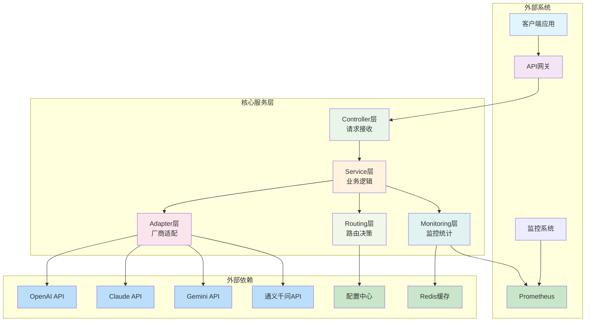
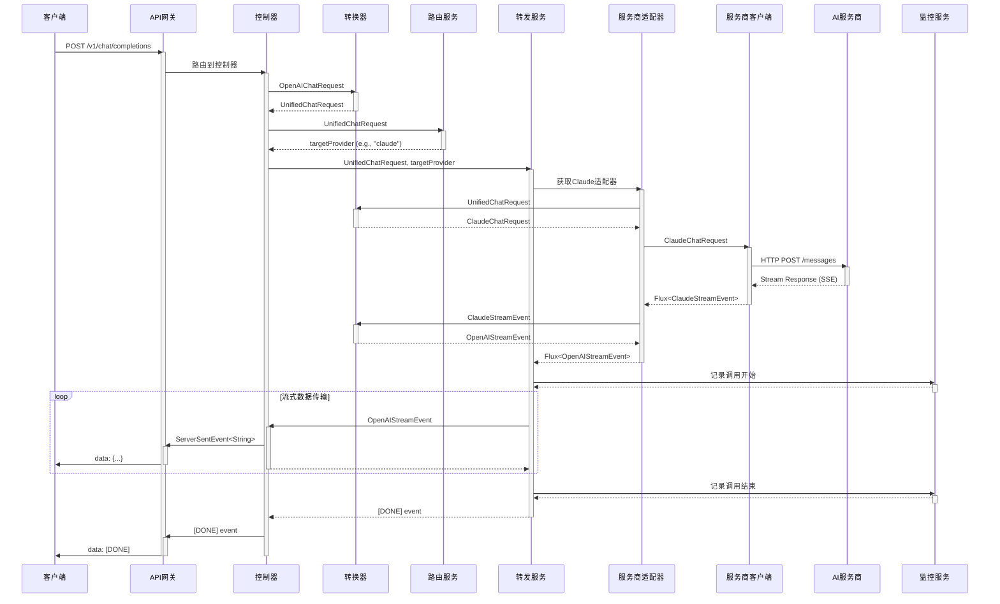
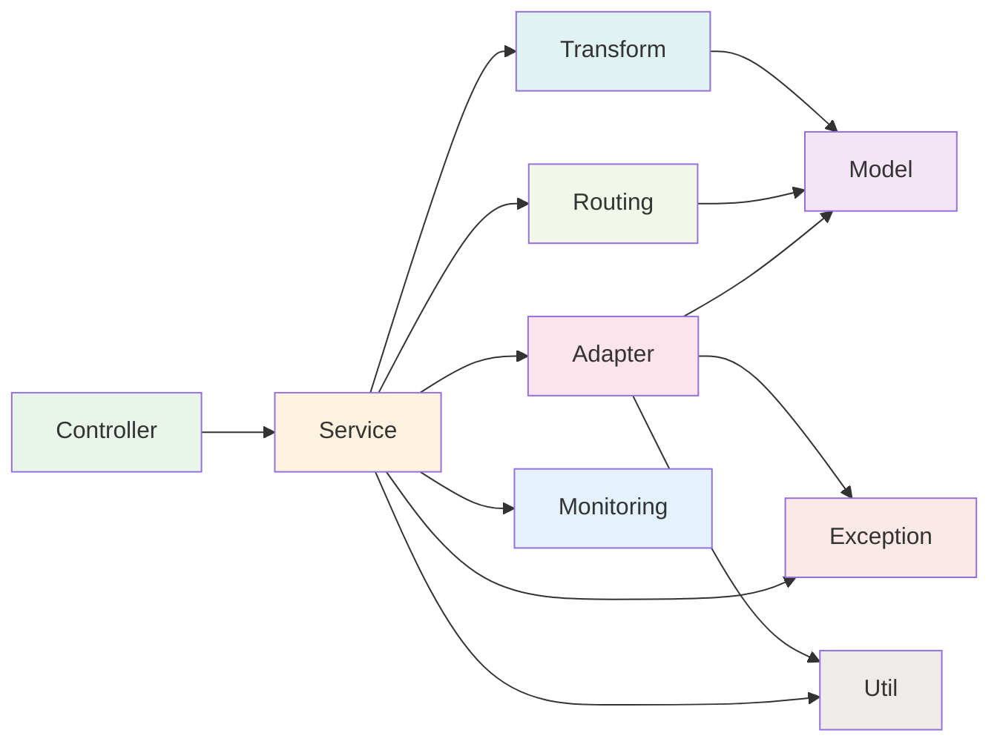

# OpenAI兼容API转发平台架构设计文档

  

## 1. 系统概述

  

### 1.1 项目目标

构建一个OpenAI API兼容的转发平台，统一接入多家AI服务商（OpenAI、Claude、Gemini、通义千问等），提供标准化的API接口和灵活的路由策略。

  

### 1.2 核心功能

- OpenAI API格式兼容

- 多AI服务商转发支持

- 流式传输处理

- 动态路由配置

- 监控统计功能

  

## 2. 系统架构图

  



  

### 2.1 数据流向图

  



  

## 3. 技术栈选择

  

### 3.1 核心技术栈

  
| 组件    | 技术选型                    | 版本   | 说明     |
| ----- | ----------------------- | ---- | ------ |
| 编程语言  | Java                    | 17+  | 稳定性和性能 |
| 框架    | Spring Boot             | 3.x  | 快速开发   |
| Web框架 | Spring WebFlux          | 3.x  | 响应式编程  |
| 构建工具  | Maven                   | 3.8+ | 依赖管理   |
| 配置管理  | Spring Configuration    | 3.x  | 外部化配置  |
| 缓存    | Redis                   | 7.x  | 数据缓存   |
| 监控    | Micrometer + Prometheus | 1.x  | 性能监控   |
| 日志    | Logback + SLF4J         | -    | 日志记录   |
| 测试    | JUnit 5 + Mockito       | 5.x  | 单元测试   |


### 3.2 依赖组件

  

```xml

<dependencies>

    <!-- Spring Boot WebFlux -->

    <dependency>

        <groupId>org.springframework.boot</groupId>

        <artifactId>spring-boot-starter-webflux</artifactId>

    </dependency>

    <!-- 配置管理 -->

    <dependency>

        <groupId>org.springframework.boot</groupId>

        <artifactId>spring-boot-starter-actuator</artifactId>

    </dependency>

    <!-- Redis缓存 -->

    <dependency>

        <groupId>org.springframework.boot</groupId>

        <artifactId>spring-boot-starter-data-redis-reactive</artifactId>

    </dependency>

    <!-- 监控指标 -->

    <dependency>

        <groupId>io.micrometer</groupId>

        <artifactId>micrometer-registry-prometheus</artifactId>

    </dependency>

    <!-- 配置处理 -->

    <dependency>

        <groupId>org.springframework.boot</groupId>

        <artifactId>spring-boot-configuration-processor</artifactId>

        <optional>true</optional>

    </dependency>

    <!-- 测试框架 -->

    <dependency>

        <groupId>org.springframework.boot</groupId>

        <artifactId>spring-boot-starter-test</artifactId>

        <scope>test</scope>

    </dependency>

    <dependency>

        <groupId>io.projectreactor</groupId>

        <artifactId>reactor-test</artifactId>

        <scope>test</scope>

    </dependency>

</dependencies>

```

  


## 4. 模块划分

  

### 4.1 项目结构

  

```

robella/

├── src/main/java/org/elmo/robella/

│   ├── RobellaApplication.java          # 启动类

│   │

│   ├── config/                              # 配置模块

│   │   ├── ApplicationConfig.java           # 应用配置

│   │   ├── ProviderConfig.java              # 服务商配置

│   │   ├── WebClientConfig.java             # HTTP客户端配置

│   │   └── RedisConfig.java                 # Redis配置

│   │

│   ├── controller/                          # 控制器模块

│   │   ├── OpenAIController.java            # OpenAI兼容API

│   │   ├── HealthController.java            # 健康检查

│   │   └── MetricsController.java           # 指标接口

│   │

│   ├── service/                             # 业务服务模块

│   │   ├── ForwardingService.java           # 核心转发服务接口

│   │   ├── ForwardingServiceImpl.java       # 核心转发服务实现

│   │   ├── RoutingService.java              # 路由决策服务

│   │   ├── TransformService.java            # 格式转换服务

│   │   └── MonitoringService.java           # 监控统计服务

│   │

│   ├── adapter/                             # 适配器模块

│   │   ├── AIProviderAdapter.java           # 适配器接口

│   │   ├── openai/

│   │   │   ├── OpenAIAdapter.java

│   │   │   └── OpenAIClient.java

│   │   ├── claude/

│   │   │   ├── ClaudeAdapter.java

│   │   │   ├── ClaudeMessageTransformer.java

│   │   │   └── ClaudeClient.java

│   │   ├── gemini/

│   │   │   ├── GeminiAdapter.java

│   │   │   ├── GeminiMessageTransformer.java

│   │   │   └── GeminiClient.java

│   │   └── qwen/

│   │       ├── QwenAdapter.java

│   │       ├── QwenMessageTransformer.java

│   │       └── QwenClient.java

│   │

│   ├── model/                               # 数据模型模块

│   │   ├── request/

│   │   │   ├── UnifiedChatRequest.java

│   │   │   ├── OpenAIChatRequest.java

│   │   │   ├── ClaudeChatRequest.java

│   │   │   └── VendorChatRequest.java

│   │   ├── response/

│   │   │   ├── UnifiedChatResponse.java

│   │   │   ├── OpenAIChatResponse.java

│   │   │   ├── ClaudeChatResponse.java

│   │   │   └── VendorChatResponse.java

│   │   └── common/

│   │       ├── UnifiedMessage.java

│   │       ├── ModelInfo.java

│   │       └── Usage.java

│   │

│   ├── exception/                           # 异常处理模块

│   │   ├── ProviderException.java

│   │   ├── TransformException.java

│   │   └── GlobalExceptionHandler.java

│   │

│   └── util/                                # 工具模块

│       ├── JsonUtils.java

│       ├── AuthUtils.java

│       └── ConfigUtils.java

│

└── src/main/resources/

    ├── application.yml                      # 主配置文件

    ├── providers.yml                        # 服务商配置

    ├── logback-spring.xml                   # 日志配置

```

  

### 4.2 各模块详细说明

  

#### 4.2.1 Config配置模块

  

**职责：**

- 管理应用配置

- 配置HTTP客户端

- 管理Redis连接

  

**主要类：**

```java

@Configuration

@EnableConfigurationProperties(ProviderProperties.class)

public class ApplicationConfig {

    // 应用级配置

}

  

@Configuration

public class WebClientConfig {

    @Bean

    public WebClient.Builder webClientBuilder() {

        return WebClient.builder()

                .codecs(configurer -> configurer

                        .defaultCodecs()

                        .maxInMemorySize(16 * 1024 * 1024));

    }

}

```

  

#### 4.2.2 Controller控制器模块

  

**职责：**

- 接收HTTP请求

- 参数验证

- 响应格式化

  

**接口定义：**

```java

@RestController

@RequestMapping("/v1")

public class OpenAIController {

    @PostMapping(value = "/chat/completions",

                produces = {MediaType.APPLICATION_JSON_VALUE, MediaType.TEXT_EVENT_STREAM_VALUE})

    public Mono<ResponseEntity<?>> chatCompletions(

            @RequestBody @Valid OpenAIChatRequest request,

            HttpServletRequest httpRequest) {

        // 流式或非流式处理

    }

    @GetMapping("/models")

    public Mono<OpenAIModelListResponse> listModels() {

        // 返回支持的模型列表

    }

}

```

  

#### 4.2.3 Service业务服务模块

  

**ForwardingService - 核心转发服务**

```java

public interface ForwardingService {

    /**

     * 非流式聊天完成

     */

    Mono<OpenAIChatResponse> forwardChatCompletion(UnifiedChatRequest request);

    /**

     * 流式聊天完成

     */

    Flux<ServerSentEvent<String>> streamChatCompletion(UnifiedChatRequest request);

    /**

     * 文本嵌入

     */

    Mono<OpenAIEmbeddingResponse> forwardEmbedding(UnifiedEmbeddingRequest request);

}

```

  

**RoutingService - 路由决策服务**

```java

public interface RoutingService {

    /**

     * 根据请求决定目标提供商

     */

    String decideProvider(UnifiedChatRequest request);

    /**

     * 获取提供商配置

     */

    ProviderConfig getProviderConfig(String providerName);

}

```

  

**TransformService - 格式转换服务**

```java

public interface TransformService {

    /**

     * OpenAI请求转统一格式

     */

    UnifiedChatRequest toUnified(OpenAIChatRequest openaiRequest);

    /**

     * 统一格式转OpenAI响应

     */

    OpenAIChatResponse toOpenAI(UnifiedChatResponse unifiedResponse);

}

```

  

#### 4.2.4 Adapter适配器模块

  

**AIProviderAdapter接口**

```java

public interface AIProviderAdapter {

    /**

     * 非流式聊天完成

     */

    Mono<VendorChatResponse> chatCompletion(VendorChatRequest request);

    /**

     * 流式聊天完成

     */

    Flux<VendorStreamEvent> streamChatCompletion(VendorChatRequest request);

    /**

     * 获取支持的模型列表

     */

    Mono<List<ModelInfo>> listModels();

    /**

     * 获取提供商名称

     */

    String getProviderName();

}

```

  

**Claude适配器示例**

```java

@Component

public class ClaudeAdapter implements AIProviderAdapter {

    private final ClaudeClient claudeClient;

    private final ClaudeMessageTransformer transformer;

    @Override

    public Mono<VendorChatResponse> chatCompletion(VendorChatRequest request) {

        ClaudeChatRequest claudeRequest = transformer.transformRequest(request);

        return claudeClient.chatCompletion(claudeRequest)

                .map(transformer::transformResponse);

    }

    @Override

    public Flux<VendorStreamEvent> streamChatCompletion(VendorChatRequest request) {

        ClaudeChatRequest claudeRequest = transformer.transformRequest(request);

        return claudeClient.streamChatCompletion(claudeRequest)

                .map(transformer::transformStreamEvent);

    }

}

```

  

#### 4.2.5 Model数据模型模块

  

**统一请求模型**

```java

@Data

public class UnifiedChatRequest {

    private String model;

    private List<UnifiedMessage> messages;

    private Double temperature;

    private Integer maxTokens;

    private Boolean stream;

    private List<Tool> tools;

    private String userId;

    // 其他通用字段...

}

```

  

**OpenAI兼容模型**

```java

@Data

public class OpenAIChatRequest {

    @NotBlank

    private String model;

    @NotEmpty

    private List<OpenAIMessage> messages;

    private Double temperature;

    private Boolean stream = false;

    // OpenAI特定字段...

}

```

  

#### 4.2.6 Exception异常处理模块

  

```java

@ControllerAdvice

public class GlobalExceptionHandler {

    @ExceptionHandler(ProviderException.class)

    public ResponseEntity<ErrorResponse> handleProviderException(ProviderException e) {

        ErrorResponse error = new ErrorResponse("provider_error", e.getMessage());

        return ResponseEntity.status(502).body(error);

    }

    @ExceptionHandler(TransformException.class)

    public ResponseEntity<ErrorResponse> handleTransformException(TransformException e) {

        ErrorResponse error = new ErrorResponse("transform_error", e.getMessage());

        return ResponseEntity.status(500).body(error);

    }

}

```

  

### 4.3 模块间依赖关系

  



  

## 5. 监控


### 5.1 监控指标

- API调用次数和成功率

- 各提供商响应时间

- 流式传输数据量

- 系统资源使用情况

  

### 5.2 日志规范

- 结构化日志输出

- 请求追踪ID

- 错误详细信息记录

  